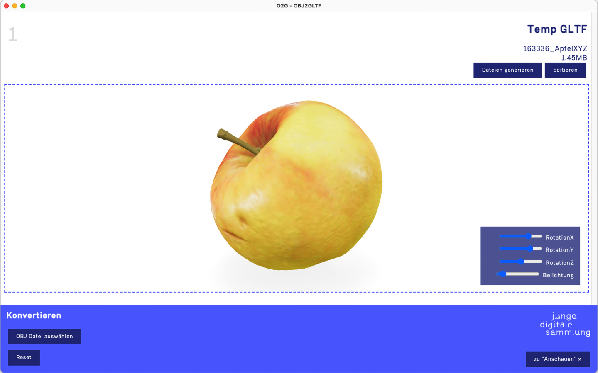
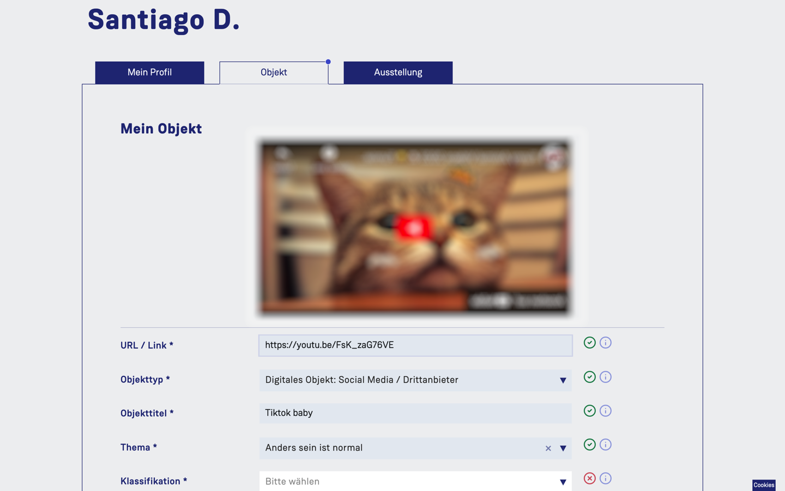
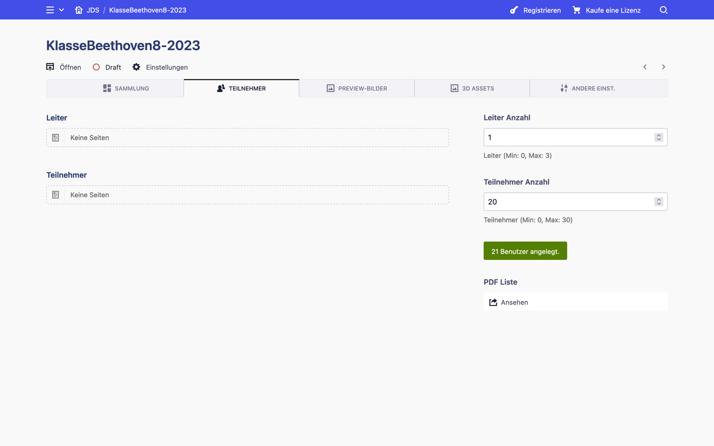
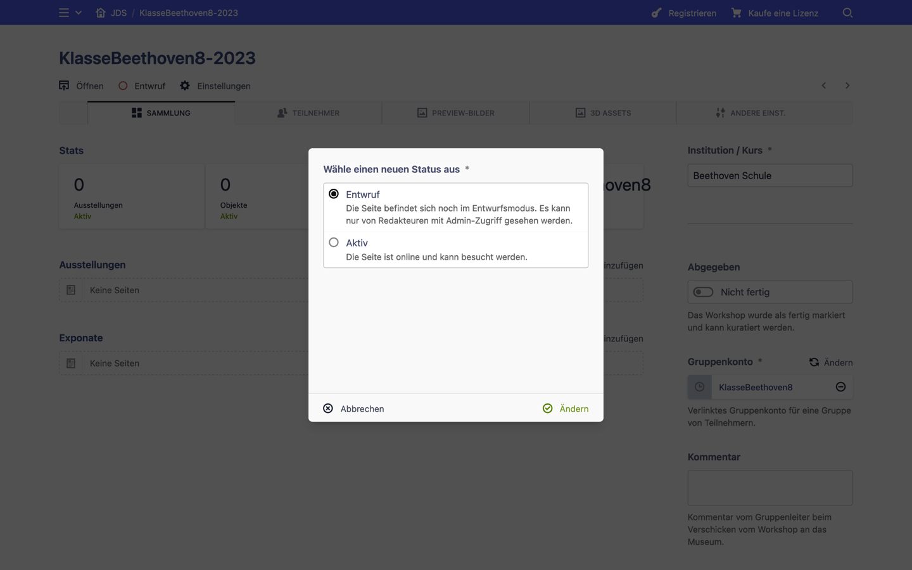

[« zurück zu README](../README.md)

---

# Benutzung

 *(Screenshots können abweichen. Screenshots enthalten Testdaten. Beschriftungen in den Screenshots könnten abweichen. Manche Bereiche wurden aus Copyright-Gründen unkenntlich gemacht)*

## Inhaltsverzeichnis

1. [Einleitung](#1-einleitung)
2. [Bereiche](#2-bereiche)
3. [Workflow und Prozess](#3-workflow-und-prozess) 

## 1. Einleitung

In seinem Teilprojekt entwickelt das Projektteam des DAHs unter dem Titel „Junge Digitale Sammlung“ (kurz JDS) ein museumspädagogisches Workshop-Angebot für Schulklassen ab der 8. Klassenstufe sowie der Oberstufe. Eine Teilnahme ist nicht nur im Klassenverband denkbar, sondern auch für Gruppen von Schüler:innen aus verschiedenen Schulen, etwa im Rahmen eines Ferienangebotes. Der Workshop setzt sich inhaltlich mit den Themenkomplexen Identität und Diversität auseinander, sowie mit der Bedeutung und Handhabung von Objekten im Museum. Im Zentrum des Workshops stehen persönliche Alltagsobjekte der Teilnehmenden. Unter dem Begriff Objekt werden bei der JDS sowohl physische Objekte als auch Born Digital Objects und sowohl eigenproduzierte als auch von anderen erstellte Werke verschiedenster Dateiformate verstanden. Materielle 2D- und 3D-Objekte werden nach Möglichkeit 3D-gescannt oder zumindest hochauflösend fotografiert. Alle Objekte werden mit Metadaten versehen. Die JDS-Plattform ist dabei sowohl Arbeitsunterstützung als auch Datenbank und Tool für die Veröffentlichung von Objekten und virtuellen Ausstellungen. 

Die Lehreinheiten finden sowohl in der Schule als auch im Museum statt und können auch in Form von Hausaufgaben weitergeführt werden. Nach einer Einführung finden sich Schüler:innen zunächst in Gruppen (3 bis max. 5 Personen) zusammen und wählen eines von vier Themen aus. Auf Grund einer geplanten langen Laufzeit sowie einer eventuellen Ausweitung des Angebots für die Erwachsenenbildung können die Themen erweitert werden. Unter dem jeweiligen thematischen Blickwinkel werden von den Teilnehmenden Alltagsobjekte ausgewählt und dazu Metadaten wie beispielsweise Material, Maße, Gewicht sowie individuelle Informationen zusammengetragen. Es kann sich dabei um physische oder digitale Objekte bzw. deren Repräsentation handeln, wenn dies aus rechtlichen Gründen möglich ist. Im Museum werden die physischen Objekte hochauflösend fotografiert und nach Möglichkeit in 3D gescannt. Alle Daten werden mittels Eingabemaske in die JDS-Plattform eingetragen. Die Gruppen können ihre Objekte jeweils in einer Ausstellung zusammenfassen, dafür erstellen sie u. a. einen gemeinsamen Titel und einen Einführungstext. Mit „Abgabe“ wird der Workshop an die Redaktion des DAHs übergeben. In Abhängigkeit davon, ob alle rechtlich relevanten Unterlagen im DAH eingegangen sind, wird ein definierter Teil der Daten auf der Plattform veröffentlicht. 

## 2. Bereiche

Die Plattform gliedert sich in folgende drei funktionelle Module:

* Sammlung-Bereich für Besucher der Platform (öffentlich zugänglich)
* Workshop-Bereich für Teilnehmer des Workshops (nicht öffentlich zugänglich)
* Admin-Bereich für Personal (nicht öffentlich zugänglich)

Sammlung-Bereich |  Workshop-Bereich  |  Admin-Bereich 
:-------------------------:|:-------------------------:|:-------------------------:
  |    |  

--

### Sammlung-Bereich

Im öffentlichen Bereich können die Besucher:innen der Webseite die freigegebenen Objekte und Ausstellungen der JDS durchstöbern, betrachten und deren Informationen lesen. Nach einem zufällig vorausgewählten Thema wird eine Übersicht mit allen Objekten oder Ausstellungen nach Veröffentlichungsdatum angezeigt. Diese kann nach Kriterien wie Klasse/Stufe oder Bundesland gefiltert werden. Eine Freitextsuche steht auch zur Verfügung. Zwischen den verschiedenen Themen kann gewechselt werden. Auch zwischen Objekten und Ausstellungen kann per Dropdown gewechselt werden.

Übersicht  |  Objekte oder Ausstellungen  |  Filter Thema
:-------------------------:|:-------------------------:|:-------------------------:
  |    |  

Unterfilter (Bundesland, Klasse)  |  Filter Bundesland  |  Suche
:-------------------------:|:-------------------------:|:-------------------------:
  |    |  

Wird ein Objekt ausgewählt, so wird eine Objektseite mit den dazugehörigen Texten dargestellt. 3D-Objekte lassen sich dort dreidimensional betrachten, Bilder vergrößern, Filme abspielen etc. 

Ist die Übersicht im Ausstellung-Modus, so gelangt man nach Auswahl einer Ausstellung zur Ausstellungs-Ansicht mit deren Titel, Texten und Objekten, die zu dieser Ausstellung gehören. Auch von dort lassen sich die Objekte auswählen und in der Objektansicht im Detail betrachten. In einer Ausstellungsansicht werden 3 bis 5 Objekte präsentiert, die thematisch in dieser Ausstellung gruppiert wurden. 

Sammlung, Ausstellungs-Ansicht  |  Ausstellungsseite  |  Objektseite
:-------------------------:|:-------------------------:|:-------------------------:
  |    |  

Bevor Inhalte, die während eines Workshops von Teilnehmern vorbereitet wurden, in diesem Bereich erscheinen, müssen sie von einem Administrator (z. B. Museumsmitarbeiter, Personal) überprüft, kuratiert und freigegeben werden.

Auch weitere, reguläre Seiten können besucht werden, z. B. eine Impressums- oder "Über das Projekt"-Seiten, etc.

--

### Workshop-Bereich

[Hier finden Sie Details zum Workshop-Bereich](details/workshop.md) »

Workshop-Räume sind virtuelle Räume, geschützte Arbeitsbereiche für Klassen oder Gruppen, mit einer zeitlichen Begrenzung. Für diese werden Gruppenkonten benötigt, die es Leiter:innen und Teilnehmer:innen ermöglicht, Objekte und deren Metadaten zur Sammlung hinzuzufügen, anzusehen und zu bearbeiten. Hierfür werden Zugänge ohne eine verpflichtende Registrierung mit E-Mail-Adressen von den Administratoren angelegt. Die Gültigkeitsdauer der Logins und damit der Zugriff auf die Workshop-Räume kann ggf. noch verändert oder verlängert werden, um flexibel auf die Entwicklungen und Bedürfnisse des Workshops eingehen zu können.

Workshop Login |  Profil-Tab  |  Objekt-Tab (gescrollt)
:-------------------------:|:-------------------------:|:-------------------------:
  |    |  

Eine Teilnehmer-Gruppe (z. B. eine ganze Schulklasse) besitzt eine Benutzername-und-Passwort-Kombination. Diese werden von einem Administrator vor Workshop-Start definiert und weiter gegeben. Jeder Teilnehmer besitzt dazu noch eine eigene ID und kann bei der ersten Anmeldung eine eigene PIN anlegen. So können gemeinsame und private Bereiche innerhalb eines Workshop-Raumes getrennt werden.

Wenn eingeloggt können Teilnehmer hier Daten zu ihrer Person und ihrem Objekt einpflegen. Bestimmte persönliche Daten werden auf der jeweiligen Objektansicht in der Sammlung angezeigt, z. B. Benutzername oder Bundesland, viele davon dienen eher statistischen Zwecken.

Gruppenkonto Login |  PIN-Eingabe nach Login  |  Lobby, um Teilnehmer zu wechseln
:-------------------------:|:-------------------------:|:-------------------------:
  |    |  

#### Objekttypen

Teilnehmer:innen stehen 3 Objekttypen zur Verfügung: physisch, digital-embed und born-digital. Diese besitzen gemeinsame Felder wie Titel, Objektstory oder Klassifikation, haben aber je nach Typ auch spezielle Felder, z. B. Maße oder Gewicht.

##### *Physische Objekte*

Diese Objekte wurden während des Workshops mittels eines 3D-Scanners eingescannt. Sollten Teilnehmer (z. B. Schüler zusammen mit einem Lehrer während des Unterrichts) vor dem Workshop-Termin vor Ort im Museum schon mal einige Inhalte bearbeiten wollen, steht ihnen ein Uploadfeld für eine Vorschau des Objekts zur Verfügung. Somit können Mitarbeiter besser einschätzen, welche Objekte die Teilnehmer mitbringen werden (dieser Schritt ist aber optional).

Es ist vorausgesehen, dass der Scan des Objekts vor Ort gemeinsam mit Hilfe von Personal erfolgt. Dementsprechend ist das System so konzipiert, dass die Mitarbeiter die 3D-Modelle und deren Vorschaubilder im Admin-Bereich hochladen. Die Teilnehmer können im Anschluss ihr Objekt auswählen. Das System erlaubt ausschliesslich GLTF- oder GLB-Dateien, da diese für Web optimiert sind.

Der 3D-Scanner vom DAH exportiert OBJ-Dateitypen. Mit Hilfe vom JDS O2G Tool können die OBJ-Dateien leicht bearbeitet und in GLTF/GLB umgewandelt werden. Mehr zu diesem Tool erfahren Sie im [O2G Repository](https://github.com/museum4punkt0/jds-o2g-electronapp).

O2G Tool |  3D-Modelle und Vorschaubilder als Admin hochladen  |  Als Teilnehmer Objekt auswählen
:-------------------------:|:-------------------------:|:-------------------------:
  |    |  

##### *Digital-embed*

Teilnehmer können auch Links aus unterschiedlichen Plattformen als Exponate präsentieren, bspw. YouTube, Spotify, TikTok, etc. Diese werden als Widget in der jeweiligen Objektansicht dargestellt. Zurzeit ist das System **für YouTube, Vimeo, TikTok, Instagram, Twitter, SoundCloud und Spotify optimiert**.

*Bitte dabei an Copyrights und andere rechtliche Eventualitäten denken und passende Datenschutzmaßnahmen ergreifen. Da alle Inhalte vor der Live-Freischaltung von Personal überprüft, kuratiert und freigegeben werden müssen, liegt grundsätzlich die Verantwortung potenzieller Copyright-Verletzungen beim Personal.*

Digital-embed |  
:-------------------------:|
  |  

##### *Born-digital*

Teilnehmer, die ihre eigenen Bilder oder Videos hochladen und präsentieren wollen, können diesen Objekttyp auswählen. Das System erlaubt übliche Bildformate (png, jpg, heic) und ausschließlich MP4 als Videoformat.

Video und Vorschaubild des Videos |  
:-------------------------:|
  |  

--

### Admin-Bereich

[Hier finden Sie Details zum Admin-Bereich](details/admin.md) »

Dieser Bereich dient sowohl der Verwaltung der Plattform durch die Mitarbeiter:innen des Museums als auch der Redaktion und Freigabe der Beiträge im öffentlichen Bereich der JDS. Projektvorbereitend werden hier Gruppen-Benutzer und Workshop-Räume angelegt. Nach Abgabe eines Workshops durch die Gruppenleiter:innen erfolgt die Redaktion durch die Mitarbeiter:innen. Die Abgabe erfolgt digital im Workshop-Bereich und die Mitarbeiter:innen bekommen eine E-Mail als Benachrichtigung. Nach Prüfung und Korrektur werden die einzelnen Beiträge für die Veröffentlichung freigegeben. Hierfür ist das Vorliegen der rechtlich relevanten Unterlagen Voraussetzung und wird daher noch einmal von den Mitarbeiter:innen überprüft.

Sichtbar im öffentlichen Bereich der Plattform wird nur ein definierter Teil der abgegebenen Daten. Alle nicht freigegebenen Objekte und Ausstellungen werden entweder von den Mitarbeitern:innen oder vom System als Teil einer automatischen Routine gelöscht. Die meisten Texte inklusive Überschriften, die seitens des DAHs auf der Plattform erscheinen, wie Begrüßungstexte und erläuternde Texte, können von Museumsmitarbeiter:innen im administrativen Bereich gepflegt werden. Dies gilt sowohl für Inhalte des öffentlichen Teils als auch der Workshop-Räume. Änderungen durch die Mitarbeiter:innen oder Teilnehmer:innen werden in einer Änderungshistorie festgehalten.

Admin-Bereich |  Workshop, Reiter Sammlung  |  Workshop, Reiter Teilnehmer
:-------------------------:|:-------------------------:|:-------------------------:
  |    |  

---

## 3. Workflow und Prozess

Folgende Schritte sollten optimalerweise in dieser Reihenfolge ablaufen:

### 1) Das Museum wird von einer Gruppe kontaktiert. Diese würde gerne teilnehmen und benötigt eine Einführung und Zugangsdaten.

Dies erfolgt auf klassischer Art, bspw. per E-Mail, etc.

### 2) Ein/e Mitarbeiter:in legt ein Gruppenkonto und einen Workshop-Raum für diese Gruppe an. Der/die Mitarbeiter:in verknüpft das Konto mit dem Workshop-Raum.

Den Admin-Bereich finden Sie unter `/panel`, z.B.:

`https://meinedomain.de/panel`

Ein Gruppenkonto, z. B. für eine komplette Klasse, kann im Bereich 'Konten' angelegt werden. Gruppenkonten sollten regelmäßig deaktiviert und im Anschluss gelöscht werden. So ist sichergestellt, dass die Teilnehmer nur für eine begrenzte Zeit Zugriff zum Workshop haben. Ein automatisiertes Löschen muss auf Ihrem Server per CRON-Job ausgeführt werden (mehr dazu im Kapitel [Technisches](details/technisches.md)).

Zur Erstellung eines Gruppenkontos muss sich der/die Mitarbeiter:in im Admin-Bereich einloggen, oben links in der Navigation "Konten" auswählen, auf "Temp. Konto anlegen" klicken und einen Namen für das Konto eingeben, z. B. KlasseBeethoven8. Das System wird automatisch ein Passwort vergeben. **Dieses Passwort unbedingt aufschreiben, um es später übergeben zu können.** 

Menü oben links |  Übersicht Konten  |  Konto anlegen
:-------------------------:|:-------------------------:|:-------------------------:
  |    |   

Der Standardwert für die Gültigkeit eines Kontos ist 30 Tage. Die Gültigkeit an sich kann aber nach dem Anlegen beliebig angepasst werden. Nachdem ein Konto nicht mehr aktiv ist, wird es nach einer gewissen Zeit gelöscht. Der Standardwert dafür sind 40 Tage. Diese Werte können im Admin-Bereich eingestellt werden.

Details Gruppenkonto |  
:-------------------------:|
 |  

Im Anschluss muss der/die Mitarbeiter:in einen Workshop anlegen. Dafür oben links im Menü zurück zu "Site" navigieren. Hier auf der Hauptansicht des Admin-Bereiches werden die Workshops aufgelistet. Einfach auf "Hinzufügen" klicken und einen sinnvollen passenden Namen (z. B. KlasseBeethoven8-2023) eingeben und den Workshop anlegen. Bitte bei der Benennung daran denken, dass Workshops voraussichtlich nicht gelöscht werden. Dementsprechend wurde in diesem Beispiel ein Suffix 2023 hinzugefügt. So kann man die Workshops auf der Liste nach einigen Jahren trotzdem noch gut identifizieren. Die genaue Systematik wird aber Ihnen überlassen.

Auf der Workshop-Seite bitte die Institution eingeben, und einen Benutzer (hier: das neu erstellte Gruppenkonto von vorhin) auswählen. Dies sind Pflichtfelder. 

*Hinweis: Auch in der Ansicht eines Temp-Users kann die Beziehung Workshop-Gruppenkonto verändert werden.*

Menü oben links |  Übersicht Workshops  |  Workshop anlegen
:-------------------------:|:-------------------------:|:-------------------------:
  |    |   

Workshop-Seite |  
:-------------------------:|
 |  

### 3) Mitarbeiter:in legt XY Teilnehmern und XZ Leitern Subkonten im Workshop-Raum an. Subkonten werden durch Seiten im System repräsentiert.

Im Reiter "Teilnehmer" können nun Leiter- und Teilnehmerkonten (bzw. Subkonten in Form von Unterseiten) generiert werden. Dazu geben Sie bitte die jeweilige gewünschte Anzahl der Leiter und Teilnehmer in die entsprechenden Felder ein und klicken Sie dann auf den Button "Generieren".

Reiter "Teilnehmer" |  Subkonten generieren  |  Subkonten Überblick
:-------------------------:|:-------------------------:|:-------------------------:
  |    |   

Zum Schluss muss der/die Mitarbeiter:in die Workshop-Seite aktivieren bzw. veröffentlichen. Dies können Sie überall tun, wo es Status-Kreise gibt, z. B. oben links unterhalb vom Workshop-Namen oder in der Übersicht der Workshops (Admin-Startseite). Die Funktion der Veröffentlichung funktioniert identisch für alle Seiten-Typen, nicht nur die Workshops.

Workshop veröffentlichen |  In der Übersicht auch möglich
:-------------------------:|:-------------------------:
  |    |

### 4) Mitarbeiter:in ruft PDF-Übersicht der Teilnehmer auf. Hier werden alle Subkonten aufgelistet und zwar ein Teilnehmer pro PDF-Seite. Jede Seite beinhaltet eine ID und den Login-Pfad für die Gruppe.

Im Reiter "Teilnehmer" und per Klick auf "PDF Liste" wird ein neuer  Browser-Tab mit der PDF-Liste geöffnet. Je nachdem wie die Übergabe erfolgen soll, diese bitte drucken oder als PDF speichern.

PDF Übersicht |  
:-------------------------:|
 | 

### 5) Der/die Mitarbeiter:in übergibt die a) Zugangsdaten des Gruppenkontos, b) Leiter-IDs und c) PDF mit Teilnehmer-IDs an die Leiter der Gruppe. 

Dabei ist zu beachten, dass die Zugangsdaten des Gruppenkontos und die Leiter-IDs getrennt und nicht in der PDF geliefert werden müssen, um zu vermeiden, dass Unbefugten diese Informationen zugänglich sind.

### 6) Leiter:in verteilt IDs und kommuniziert Zugangsdaten für das Gruppenkonto.

Dies erfolgt auf klassische Art, bspw. persönlich oder per E-Mail, etc.

### 7) Ab jetzt kann jede:r Teilnehmer:in (und Leiter:in) sich einloggen und den Workshop benutzen.

Die Login-Seite für den Workshop-Bereich finden die Teilnehmer unter `/login`, z. B.:

`https://meinedomain.de/login`

Bei der ersten Anmeldung müssen sowohl Leiter:innen als auch Teilnehmer:innen eine PIN anlegen. Somit sind die jeweiligen Arbeitsbereiche im Workshop-Raum geschützt.

Workshop Login-Seite | Benutzer PIN Identifizierung
:-------------------------:|:-------------------------:
 | 

### 8) Die Gruppe trägt Daten ein. In der Schule, zuhause oder unterwegs.

Ab hier sollte der Ablauf selbsterklärend sein. Teilnehmer:innen können persönliche oder objektbezogene Daten eingeben, Ausstellungen gemeinsam bearbeiten, Leiter können den Status der Benutzer und ihrer Objekte sehen, PIN der Teilnehmer zurücksetzen, etc. Die Teilnehmer:innen müssen zunächst auch einer Nutzungsvereinbarung mit DSE zustimmen.

Das Eingeben der Daten erfolgt über Eingabemasken mit Freitextfeldern und Dropdowns. Es gibt Pflichtfelder und optionale Eingabemöglichkeiten – Pflichtfelder sind als solche gekennzeichnet.

Diese Phase dauert einige Tage oder evtl. Wochen lang. Die Teilnehmer:innen können vor, während oder nach dem Vor-Ort-Termin im Museum ihre Daten bearbeiten.

[Hier finden Sie Details zum Workshop-Bereich](details/workshop.md) »

Beispiel Teilnehmer | Leiter Auflistung Teilnehmer | Leiter Auflistung Ausstellungen
:-------------------------:|:-------------------------:|:-------------------------:
 |  | 

### 9) Vor-Ort-Termin im Museum. Die Gruppe arbeitet gemeinsam mit den Mitarbeitern:innen.

Vor Ort im Museum werden unter anderem die physischen Objekte gemeinsam mit Mitarbeiter:innen gescannt. Nachdem ein Objekt als OBJ-Datei gespeichert wurde (3D-Scanner haben üblicherweise eine eigene Software, die das beherrschen sollte), kann es in eine GLTF/GLB mit Hilfe von "O2G" umgewandelt werden. Diese Anwendung wurde extra für die Plattform entwickelt und kann das 3D-Model leicht abändern, um bestmögliche Ergebnisse für die Darstellung auf der Website liefern zu können. In O2G werden pro Objekt 3 Dateien exportiert: ein Vorschaubild des Objekts, eine GLB 3D-Datei, die weboptimiert ist, und eine GLTF 3D-Datei, die weboptimiert und noch mal komprimiert wird. So können die Mitarbeiter:innen in jedem einzelnen Fall entscheiden, welche Datei sie verwenden wollen. Man sucht hier ein gutes Qualität-Dateigröße-Verhältnis.

Die Mitarbeiter:innen können dann die aus O2G generierten statischen Bilder und die ausgewählten 3D-Dateien im Admin-Bereich hochladen (multiples Hochladen erlaubt). Nachdem die Bilder hochgeladen wurden, erscheinen sie im Workshop-Bereich und zwar nur für die Benutzer, die ein physisches Objekt angelegt haben. Die Teilnehmer:innen können nun ein Vorschaubild auswählen, und falls die passende 3D-Datei gefunden wird, sind Bilddatei und 3D-Datei mit dem Objekt verlinkt.

O2G Tool | Upload im Admin-Bereich
:-------------------------:|:-------------------------:
 | 

Upload im Admin-Bereich | Auswahl für die Teilnehmer
:-------------------------:|:-------------------------:
 | 

### 10) Abschicken des Workshops durch Leiter:innen.

Wenn der/die Leiter:in der Gruppe den Workshop als fertig markieren will, damit die Mitarbeiter:innen mit der Überprüfung der Daten und Freigabe der Seiten anfangen können, kann er/sie das per Knopfdruck auf "Workshop abschicken" tun. Hier werden ein paar Hinweise angezeigt, und der/die Leiter:in kann eine kurze Nachricht für die Mitarbeiter:innen eingeben.

Workshop | Abschicken des Workshops |  Generierte E-Mail
:-------------------------:|:-------------------------:|:-------------------------:
 |  |  

Eine E-Mail wird für das Museum generiert. Die E-Mail-Adressen, die im System eingestellt sind, erhalten diese Mail. Sie enthält eine Übersicht der verschickten Daten.

### 11) Die Mitarbeiter überprüfen und - falls nötig - korrigieren die Daten (z. B. Schreibfehler), veröffentlichen die freigegebenen und - wenn gewünscht - löschen die nicht freigegebenen Objekte und Ausstellungen in dem jeweiligen Workshop.

Im Admin-Bereich können die Mitarbeiter:innen die freigegebenen Objekte und Ausstellungen ähnlich wie für die Workshops veröffentlichen: oben links unterhalb vom Namen oder auf der jeweiligen Liste. Als kleine Hilfe hat das Personal eine grüne Markierung für Objekte und Ausstellungen, die vollständige Daten enthalten. Der Hinweis des/der Leiters:in ist hier auch zu sehen.

Veröffentlichte Seiten werden sofort in der Sammlung angezeigt. Sie können jederzeit deaktiviert werden.

Übersicht Ausstellungen und Objekte | Objekt ist veröffentlicht  
:-------------------------:|:-------------------------:
 | 

### 12) Der Workshop ist somit vollständig abgeschlossen. Es folgen bestimmte Aufgaben, um die Plattform zu bereinigen.

Das System hat 3 Funktionen, die entweder per Klick oder CRON (automatisch von Ihrem Server) ausgelöst werden können. Um die Funktionen händisch auszulösen, gehen Sie bitte auf die Hauptseite des Admin-Bereichs, Tab "Website Einstellungen". Die Buttons befinden sich am Ende der Ansicht.

#### Workshops bereinigen

Das System geht alle Workshops durch, die noch nicht als bereinigt markiert sind. Bereinigen bedeutet in diesem Fall das Löschen von Ausstellungen und Objekten, die a) keine vollständigen Daten haben ***und*** b) nicht veröffentlicht wurden. Erst wenn beide Bedingungen zutreffen, wird die Seite gelöscht.

Ein Workshop wird auch bereinigt, wenn das verlinkte Gruppenkonto gelöscht wird.

#### Benutzer deaktivieren

Diese Funktion deaktiviert die temporären Gruppenkonten, dessen Gültigkeit abgelaufen ist. Das heißt, wenn Sie sofort einen Benutzer deaktivieren wollen, bewirkt diese Funktion nichts, da sie nur Kontos mit einem Gültigkeitsdatum älter als "heute" deaktiviert.

#### Inaktive Benutzer löschen

Mit dieser Funktion werden inaktive Gruppenkonten endgültig gelöscht. Sie überprüft, ob die Lösch-Gültigkeit abgelaufen ist, um erst dann das Konto zu löschen. Die Lösch-Gültigkeit setzt sich zusammen aus "Ablaufdatum des Kontos" + "eingestellter Warteperiode (in Tagen) bis zum Löschen". 

Wie weiter oben beschrieben: Vor dem Löschen des Kontos wird auch der damit verknüpfte Workshop erst mal bereinigt.

System-Funktionen | 
:-------------------------:|
 | 

---

[« zurück zu README](../README.md)
