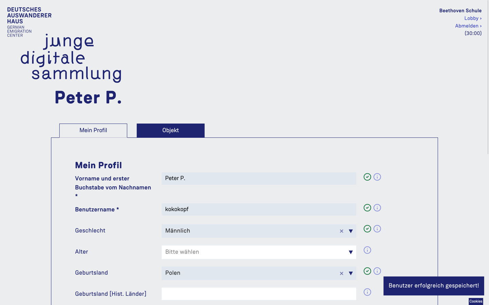
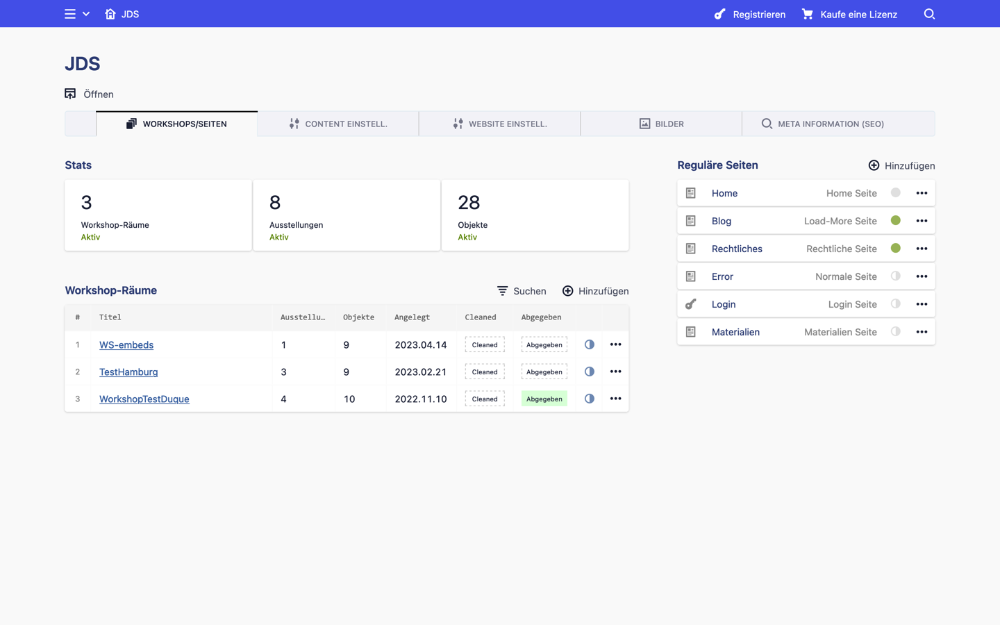
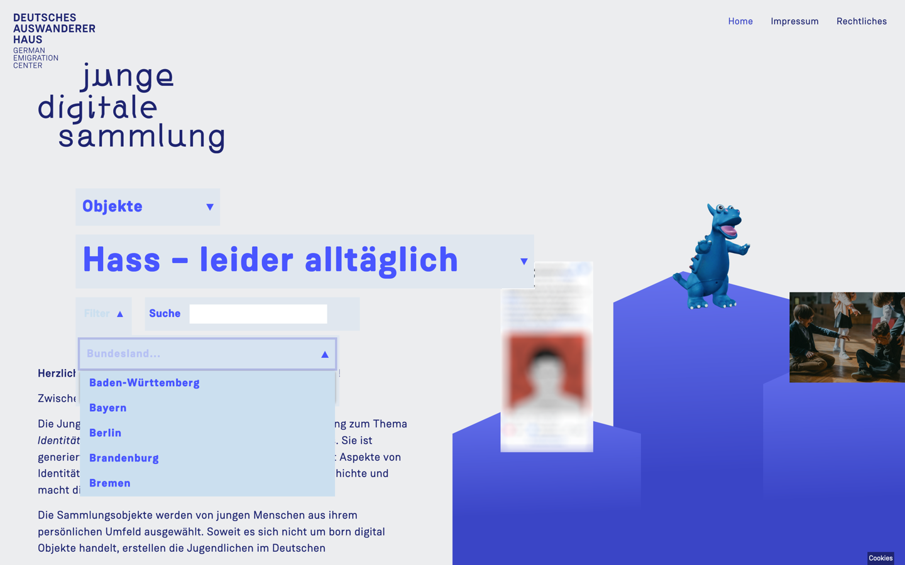
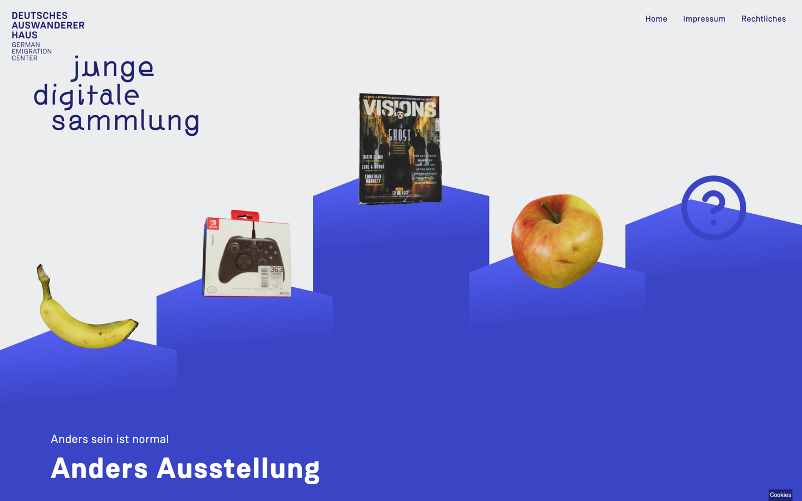
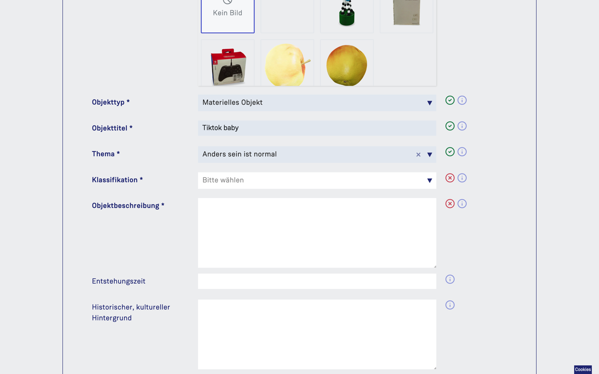
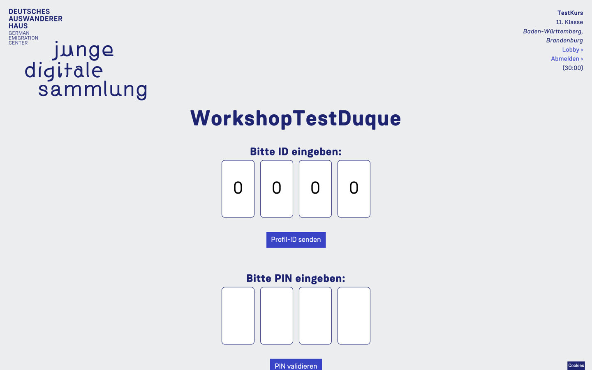

# Benutzung

 *(Screenshots können abweichen. Screenshots enthalten Testdaten)*

## Inhaltsverzeichnis

1. [Einleitung](#1-einleitung)
2. [Bereiche](#2-bereiche)
3. [Workflow und Prozess](#3-workflow-und-prozess)

## 1. Einleitung

In seinem Teilprojekt entwickelt das Projektteam des DAHs unter dem Titel „Junge Digitale Sammlung“ (kurz JDS) ein museumspädagogisches Workshop-Angebot für Schulklassen ab der 8. Klassenstufe sowie der Oberstufe. Eine Teilnahme ist nicht nur im Klassenverband denkbar, sondern auch für Gruppen von Schüler:innen aus verschiedenen Schulen, etwa im Rahmen eines Ferienangebotes. Der Workshop setzt sich inhaltlich mit den Themenkomplexen Identität und Diversität auseinander sowie mit der Bedeutung und Handhabung von Objekten im Museum. Im Zentrum des Workshops stehen persönliche Alltagsobjekte der Teilnehmenden. Unter dem Begriff Objekt werden bei der JDS sowohl physische Objekte als auch Born Digital Objects und sowohl eigen produzierte als auch von anderen erstellte Werke verschiedenster Dateiformate verstanden. Materielle 2D- und 3D-Objekte werden nach Möglichkeit 3D-gescannt oder zumindest hochauflösend fotografiert. Alle Objekte werden mit Metadaten versehen. Die JDS-Plattform ist dabei sowohl Arbeitsunterstützung als auch Datenbank und Tool für die Veröffentlichung von Objekten und virtuellen Ausstellungen. 

Die Lehreinheiten finden sowohl in der Schule als auch im Museum statt und können auch in Form von Hausaufgaben weitergeführt werden. Nach einer Einführung finden sich Schüler:innen zunächst in Gruppen (3 bis max. 5 Personen) zusammen und wählen eines von vier Themen aus. Auf Grund einer geplanten langen Laufzeit sowie einer eventuellen Ausweitung des Angebots für die Erwachsenenbildung können die Themen erweitert werden. Unter dem jeweiligen thematischen Blickwinkel werden von den Teilnehmenden Alltagsobjekt ausgewählt und dazu Metadaten wie beispielsweise Material, Maße, Gewicht sowie individuelle Informationen zusammengetragen. Es kann sich dabei um physische oder digitale Objekte bzw. deren Repräsentation handeln, wenn dies aus rechtlichen Gründen möglich ist. Im Museum werden die physischen Objekte hochauflösend fotografiert und nach Möglichkeit in 3D-gescannt. Alle Daten werden mittels Eingabemaske in die JDS-Plattform eingetragen. Die Gruppen können ihre Objekte jeweils in einer Ausstellung zusammenfassen, dafür erstellen sie u. a. einen gemeinsamen Titel und einen Einführungstext. Mit „Abgabe“ wird das Workshop an die Redaktion des DAHs übergeben. In Abhängigkeit davon, ob alle rechtlich relevanten Unterlagen im DAH eingegangen sind, wird ein definierter Teil der Daten auf der Plattform veröffentlicht. 

## 2. Bereiche

Die Plattform gliedert sich in folgende drei funktionelle Module:

* Sammlung-Bereich für Besucher der Platform (öffentlich zugänglich)
* Workshop-Bereich für Teilnehmer des Workshops (nicht öffentlich zugänglich)
* Admin-Bereich für Personal (nicht öffentlich zugänglich)

Sammlung-Bereich |  Workshop-Bereich  |  Admin-Bereich 
:-------------------------:|:-------------------------:|:-------------------------:
  |    |  

--

### Sammlung-Bereich

Im öffentlichen Bereich können die Besucher:innen der Webseite die freigegebenen Objekte und Ausstellungen der JDS durchstöbern, betrachten und deren Informationen lesen. Nach einem zufällig vorausgewählten Thema wird eine Übersicht mit allen Objekten oder Ausstellungen nach Veröffentlichungsdatum angezeigt. Diese kann nach Kriterien wie Klasse/Stufe oder Bundesland gefiltert werden. Eine Freitextsuche steht auch zur Verfügung. Zwischen den verschiedenen Themen kann gewechselt werden. Auch zwischen Objekte und Ausstellungen kann per Dropdown gewechselt werden.

Übersicht  |  Objekte oder Ausstellungen  |  Filter Thema
:-------------------------:|:-------------------------:|:-------------------------:
  |    |  

Unterfilter  |  Filter Bundesland  |  Suche
:-------------------------:|:-------------------------:|:-------------------------:
  |    |  

Wird ein Objekt ausgewählt, so wird eine Objektseite mit den dazugehörigen Texten dargestellt. 3D-Objekte lassen sich dort dreidimensional betrachten, Bilder vergrößern, Filme abspielen etc. 

Ist die Übersicht in Ausstellung-Modus, so gelangt man nach Auswahl einer Ausstellung zur Ausstellungs-Ansicht mit deren Titel, Texten und Objekten, die zu dieser Ausstellung gehören. Auch von dort lassen sich die Objekte auswählen und in der Objektansicht im Detail betrachten. In einer Ausstellungsansicht werden 3 bis 5 Objekte präsentiert, die thematisch in dieser Ausstellung gruppiert wurden. 

Sammlung, Ausstellungs-Ansicht  |  Ausstellungsseite  |  Objektseite
:-------------------------:|:-------------------------:|:-------------------------:
  |    |  

Bevor Inhalte, die während eines Workshops von Teilnehmern vorbereitet wurden, in diesem Bereich erscheinen, müssen sie von einem Administrator (z. B. Museumsmitarbeiter, Personal) überprüft, kuratiert und freigegeben werden.

Auch weitere, reguläre Seiten können besucht werden, z.B. eine Impressums- oder "Über das Projekt"-Seiten, etc.

--

### Workshop-Bereich

Workshop-Räume sind virtuelle Räume, geschützte Arbeitsbereiche für Klassen oder Gruppen, mit einer zeitlichen Begrenzung. Für diese werden Gruppen-Konten benötigt, die es Leiter:innen und Teilnehmer:innen ermöglicht, Objekte und deren Metadaten zur Sammlung hinzuzufügen, anzusehen und zu bearbeiten. Hierfür werden Zugänge ohne eine verpflichtende Registrierung mit E-Mail-Adressen von den Administratoren angelegt. Die Gültigkeitsdauer der Logins und damit der Zugriff auf die Workshop-Räume kann ggf. noch verändert oder verlängert werden, um flexibel auf die Entwicklungen und Bedürfnisse des Workshops eingehen zu können.

Workshop Login |  Profil-Tab  |  Objekt-Tab (gescrollt)
:-------------------------:|:-------------------------:|:-------------------------:
  |    |  

Eine Teilnehmer-Gruppe (z. B. eine ganze Schulklasse) besitzt eine Benutzername und Passwort Kombination. Diese werden von einem Administrator vor Workshop-Start definiert und weiter gegeben. Jeder Teilnehmer besitzt dazu noch eine eigene ID und kann bei der ersten Anmeldung eine eigene PIN anlegen. So können kommunale und private Bereiche innerhalb eines Workshopraumes getrennt werden.

Wenn eingeloggt können Teilnehmer hier Daten zu ihrer Person und ihrem Objekt einpflegen. Bestimmte persönliche Daten werden auf der jeweiligen Objektansicht in der Sammlung angezeigt, z. B. Benutzername oder Bundesland, viele davon dienen aber eher für interne Zwecke des Personals.

Gruppen-Konto Login |  PIN Eingabe nach Login  |  Lobby, um Teilnehmer zu Wechseln
:-------------------------:|:-------------------------:|:-------------------------:
  |    |  

#### Objekttypen

Teilnehmer:innen stehen 3 Objekttypen zur Verfügung: physisch, digital-embed und born-digital. Diese besitzen gemeinsame Felder wie Titel, Objektstory oder Klassifikation, haben aber je nach Typ auch spezielle Felder, z. B. Maße oder Gewicht.

##### *Physische Objekte*

Diese Objekte wurden während des Workshops mittels eines 3D Scanners eingescannt. Sollten Teilnehmer (z. B. Schüler zusammen mit einem Lehrer während des Unterrichts) vor dem vor Ort Workshop-Termin im Museum schon mal einige Inhalte bearbeiten wollen, steht ihnen ein Uploadfeld für eine Vorschau des Objekts zur Verfügung. Somit können Mitarbeiter besser einschätzen, welche Objekte die Teilnehmer mitbringen werden (dieser Schritt ist aber optional).

Es ist vorausgesehen, dass der Scan des Objekts vor Ort gemeinsam mit Hilfe von Personal erfolgt. Dementsprechend ist das System so konzipiert, dass die Mitarbeiter die 3D-Modelle und dessen Vorschaubilder im Admin-Bereich hochladen. Die Teilnehmer können im Anschluss ihr Objekt auswählen. Das System erlaubt ausschliesslich GLTF oder GLB Dateien, da diese für Web optimiert sind.

Der 3D Scanner vom DAH exportiert OBJ Dateintypen. Mit Hilfe vom JDS O2G Tool können die OBJ Dateien leicht bearbeitet und in GLTF/GLB umgewandelt werden. Mehr zu diesem Tool erfahren Sie im O2G Repository.

!!!!!!!! -- LINK ZUM O2G REPO -- !!!!!!

O2G Tool |  3D Modelle und Vorschaubilder als Admin hochladen  |  Lobby, um Teilnehmer zu Wechseln
:-------------------------:|:-------------------------:|:-------------------------:
  |    |  

##### *Digital-embed*

Teilnehmer können auch Links aus unterschiedlichen Platformen als Exponate präsentieren, bspw. YouTube, Spotify, TikTok, etc. Diese werden als Widget in der jeweiligen Objektansicht dargestellt. Zurzeit ist das System **für YouTube, Vimeo, TikTok, Instagram, Twitter, Soundcloud und Spotify optimiert**.

*Bitte dabei an Copyrights und andere rechtlichen Eventualitäten denken und passende Datenschutzmasnahmen ergreifen. Da alle Inhalte vor der Live-Freischaltung von Personal überprüft, kuratiert und freigegeben werden müssen liegt grundsätzlich die Verantwortung potenzieller Copyright-Verletzungen beim Personal.*

##### *Born-digital*

Für Teilnehmer die eigene Bilder oder Videos hochladen und präsentieren wollen. Das System erlaubt übliche Bildformate (png, jpg, heic) und ausschließlich MP4 als Videoformat.

--

### Admin-Bereich

Dieser Bereich dient sowohl der Verwaltung der Plattform durch die Mitarbeiter:innen des Museums als auch der Redaktion und Freigabe der Beiträge im öffentlichen Bereich der JDS. Projekt vorbereitend werden hier Gruppen-Benutzer und Workshopräume angelegt. Nach Abgabe durch die Teilnehmer:innen bzw. Leiter:innen erfolgt die Redaktion durch die Mitarbeiter. Nach Prüfung und Korrektur werden die einzelnen Beiträge für die Veröffentlichung freigegeben. Hierfür ist das Vorliegen der rechtlich relevanten Unterlagen Voraussetzung und wird daher noch einmal von den Mitarbeiter:innen überprüft. Sichtbar im öffentlichen Bereich der Plattform wird nur ein definierter Teil der eingegebenen Daten. Alle nicht freigegebenen Objekte und Ausstellungen werden entweder von den Mitarbeitern oder vom System als Teil einer automatischen Routine gelöscht. Die meisten Texte inklusive Überschriften, die seitens des DAHs auf der Plattform erscheinen, wie Begrüßungstexte und erläuternde Texte, können von Museumsmitarbeiter:innen im administrativen Bereich gepflegt werden. Dies gilt sowohl für Inhalte des öffentlichen Teils als auch der Workshopräume. Änderungen durch die Mitarbeiter:innen oder Teilnehmer:innen werden in einer Änderungshistorie festgehalten.

---

## 3. Workflow und Prozess

Folgende Schritte sollten optimalerweise in dieser Reihenfolge ablaufen:

- Das Museum wird von einer Gruppe kontaktiert. Diese würde gerne teilnehmen und benötigt eine Einführung und Zugangsdaten.
- Ein Mitarbeiter:in legt ein Gruppen-Konto und ein Workshop-Raum für diese Gruppe an. Der Mitarbeiter verknüpft das Konto mit dem Workshop-Raum.
- Mitarbeiter:in legt XY Teilnehmer und XZ Leiter Subkonten im Workshop-Raum an. Subkonten werden durch Seiten im System repräsentiert.
- Mitarbeiter:in ruft PDF-Übersicht der Teilnehmer auf. Hier werden alle Subkonten aufgelistet und zwar ein Teilnehmer pro PDF Seite. Jede Seite beinhaltet eine ID und den Login-Pfad für die Gruppe.
- Mitarbeiter:in übergibt die a) Zugangsdaten des Gruppenkontos, b) Leiter IDs und c) PDF mit Teilnehmer IDs an die Leiter der Gruppe. Zugangsdaten und Leiter IDs werden getrennt und nicht in der PDF geliefert um zu vermeiden, dass diese Informationen nicht für alle Teilnehmer:innen zugänglich sind.
- Leiter:in verteilt IDs und kommuniziert Zugangsdaten für das Gruppen-Konto.
- Ab jetzt kann jede:r Teilnehmer:in (und Leiter:in) sich einloggen und das Workshop benutzen.
- Bei der ersten Anmeldung müssen sowohl Leiter:innen als auch Teilnehmer:innen eine PIN anlegen. Somit sind die jeweiligen Arbeitsbereiche im Workshop-Raum geschützt.
