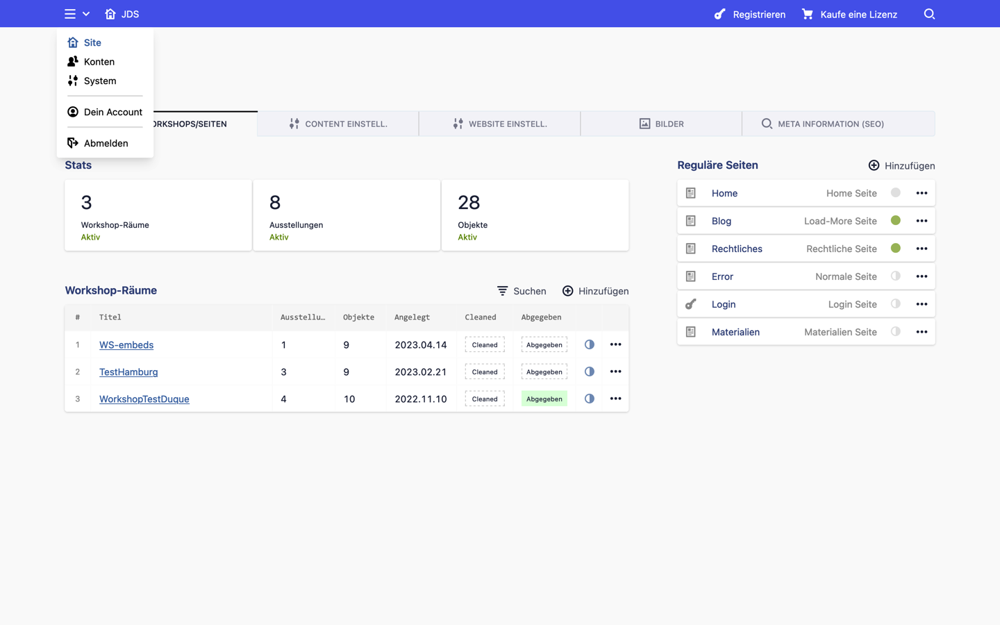
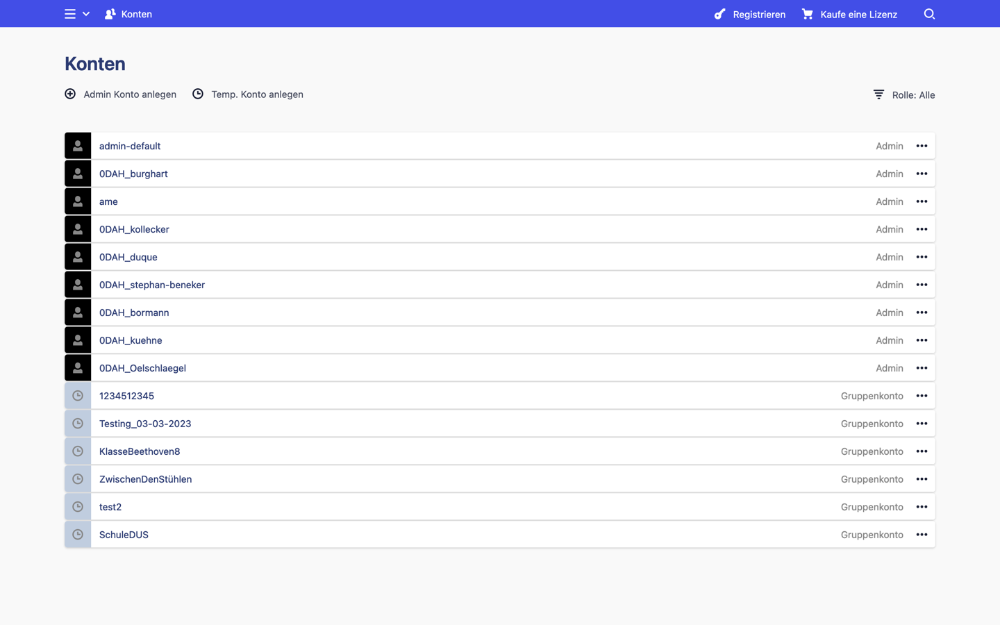

[« Intro](README.md)

---

# Benutzer
Gruppenbenutzer, z.B. für eine komplette Klasse, können im Bereich 'Temp users' angelegt werden. Sie sollten regelmäßig deaktiviert und im Anschluss gelöscht werden. So ist es sicher gestellt, dass die Teilnehmer nur für eine begrenzte Zeit Zugriff zum Workshop haben.

Temp users im Menü           |  Übersicht  |  Benutzer anlegen
:-------------------------:|:-------------------------:|:-------------------------:
    |    |    

Der Standardwert für die Gültigkeit eines Kontos ist 30 Tage. Dies kann in dem Blueprint für die Frontend-Benutzer angepasst werden. Dieser Wert wird beim Anlegen eines Kontos übernommen. Er kann im Admin-Backend aber jederzeit wieder angepasst werden.

***blueprints/users/frontenduser.yml***

    expiration:
        label: Verfallsdatum
        type: date
        ...
        default: today + 30 day

---

[« Intro](README.md)