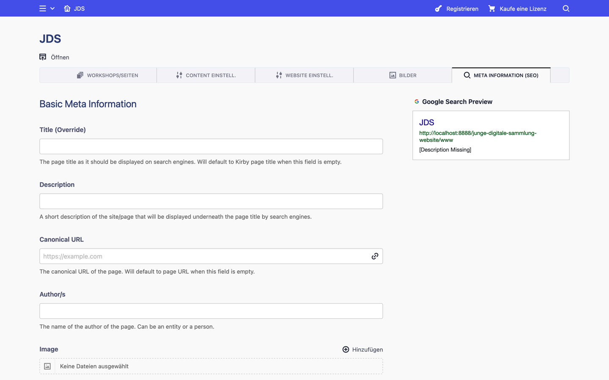
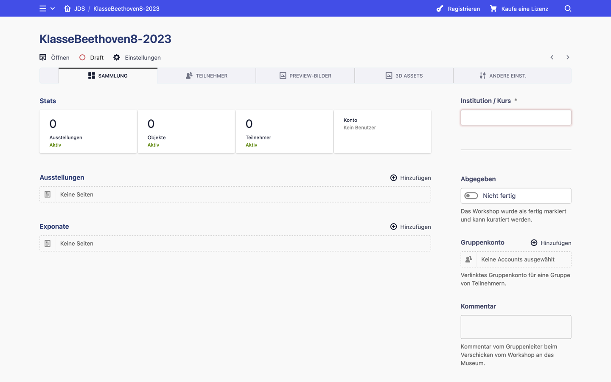
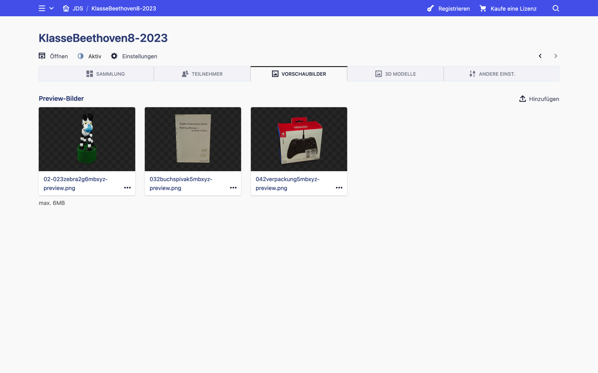
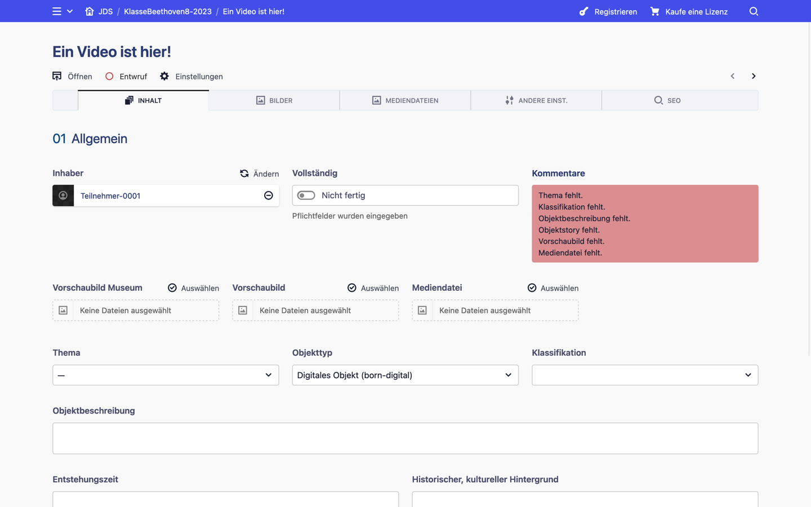
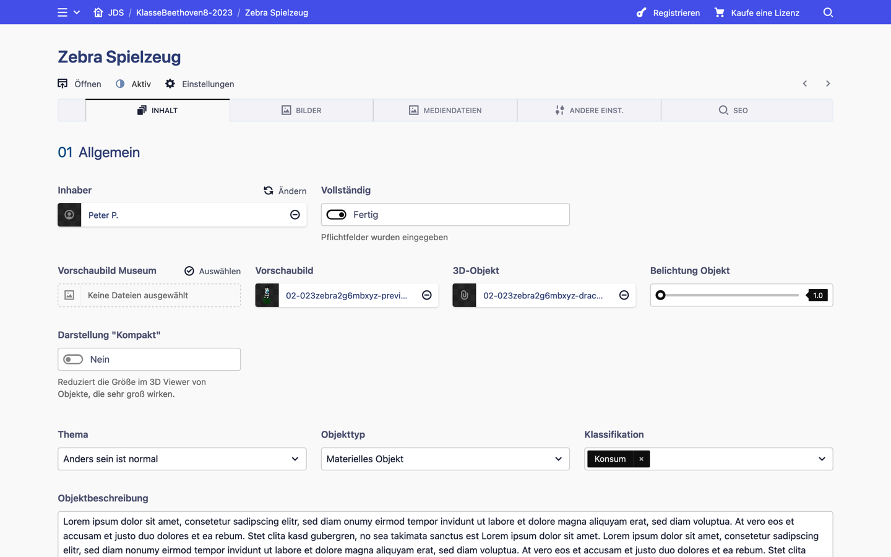
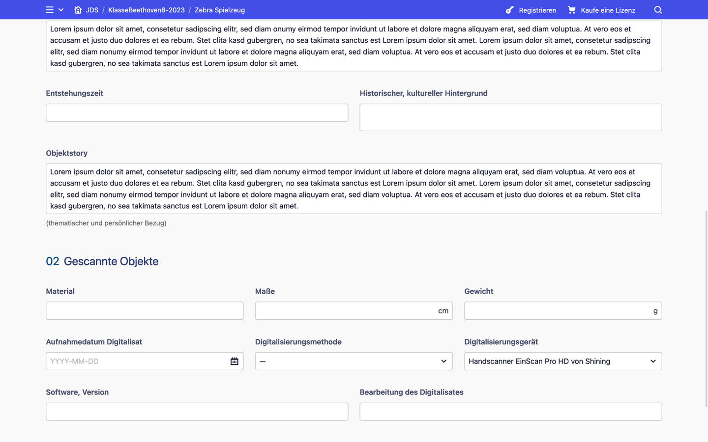
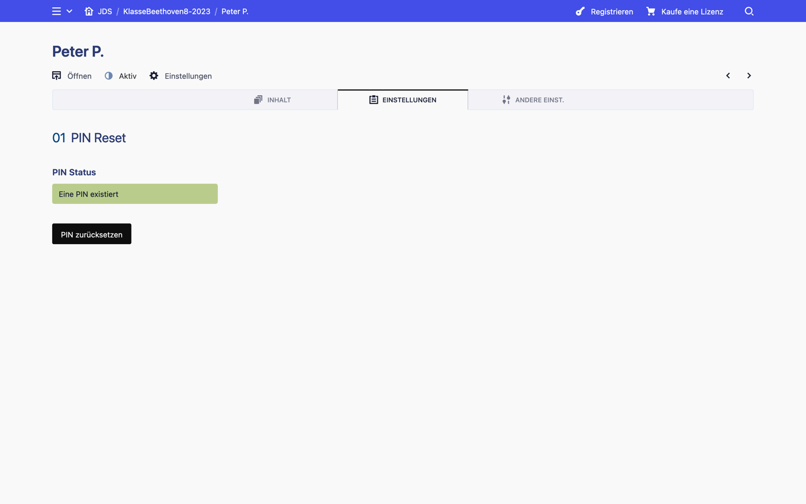
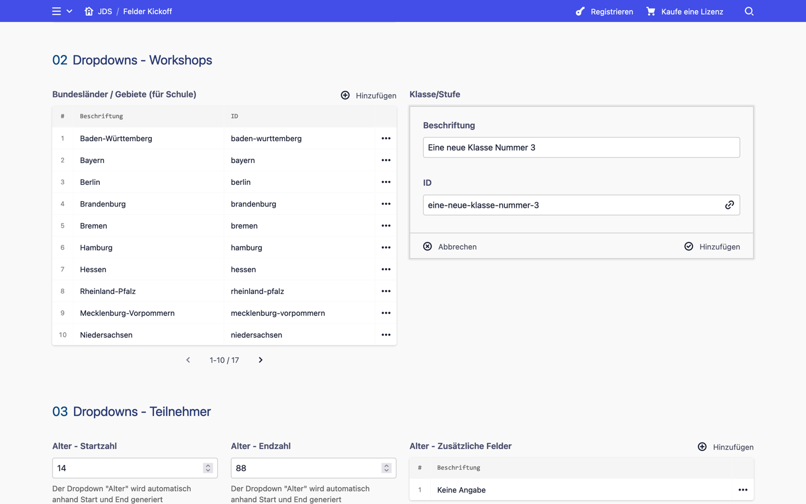
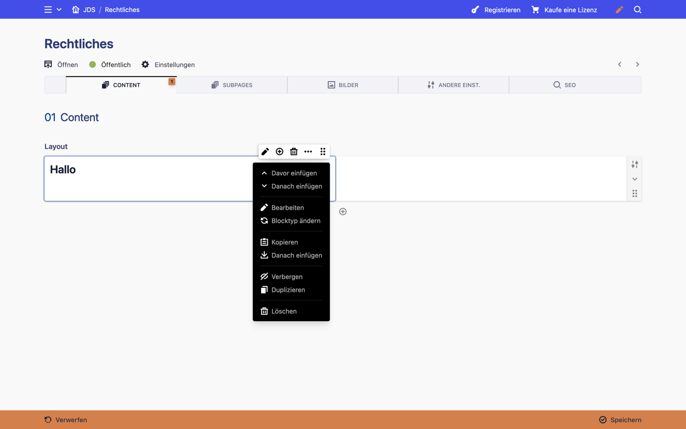

[« Benutzung](../README.md)

---

# Admin-Bereich

Im Admin-Bereich
[---TODO---]

Es wird empfohlen die Kirby Dokumentation zu stöbern.
https://getkirby.com/docs/guide/content/introduction

## Site

Workshop-Tab (Hauptansicht) |  Content-Tab
:-------------------------:|:-------------------------:
  |  

System-Tab |  Bilder-Tab
:-------------------------:|:-------------------------:
  |  

SEO-Tab |  
:-------------------------:|
  |  

## Benutzer

Admin-Konto |  Gruppen-Konto
:-------------------------:|:-------------------------:
  |  

## Workshop

Sammlung-Tab (leer) |  Sammlung-Tab  | Sammlung-Tab (gescrollt)
:-------------------------:|:-------------------------:|:-------------------------:
  |   |  

Vorschaubilder-Tab |  3D Modelle-Tab
:-------------------------:|:-------------------------:
  |  

Andere Einst.-Tab |  
:-------------------------:|
  |  

## Objekt

Inhalt-Tab (leer) |  Inhalt-Tab  | Inhalt-Tab (gescrollt)
:-------------------------:|:-------------------------:|:-------------------------:
  |   |  

Bilder-Tab |  Medien-Tab
:-------------------------:|:-------------------------:
  |  

Andere Einst.-Tab |  SEO-Tab
:-------------------------:|:-------------------------:
  |  

## Ausstellung

Inhalt-Tab |  Andere Einst.-Tab  | SEO-Tab
:-------------------------:|:-------------------------:|:-------------------------:
  |   |  

## Teilnehmer

Inhalt-Tab |  Einstellungen-Tab  | Andere Einst.-Tab 
:-------------------------:|:-------------------------:|:-------------------------:
  |   |  

## Leiter

Einstellungen-Tab  | Andere Einst.-Tab 
:-------------------------:|:-------------------------:
 |  

## Besondere Seiten

### Datenfelder

Daten |  Daten eingeben  |  JSON Dateien
:-------------------------:|:-------------------------:|:-------------------------:
  |   | 

### Beschriftungen und Nachrichten

Beschriftungen |  Beschriftungen (gescrollt)
:-------------------------:|:-------------------------:
  |  

### Materialien und Materialien Paket

Materialien |  Materialien Paket (Subseite)
:-------------------------:|:-------------------------:
  |  

### Blog
Blog  |  Blog Subseiten  |  Blog im Frontend
:-------------------------:|:-------------------------:|:-------------------------:
 |   |  

### Normale Seiten
Inhalt normaler Seiten |  Subseiten normaler Seiten
:-------------------------:|:-------------------------:
  |  

---

[« Benutzung](../README.md)