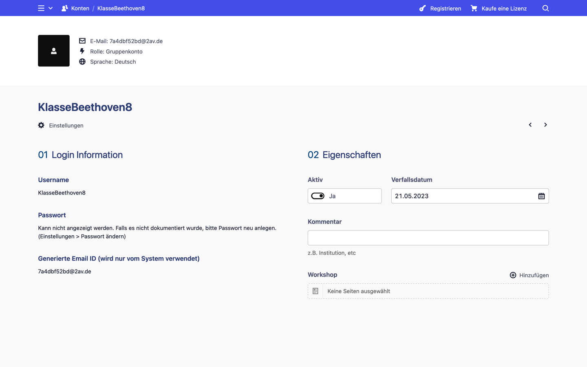
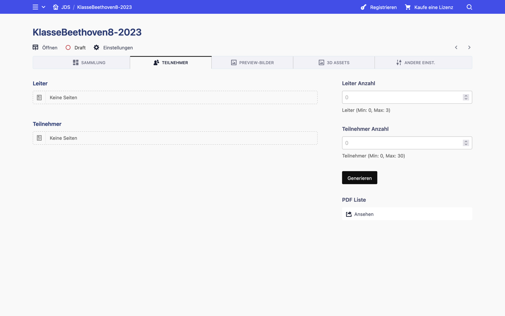
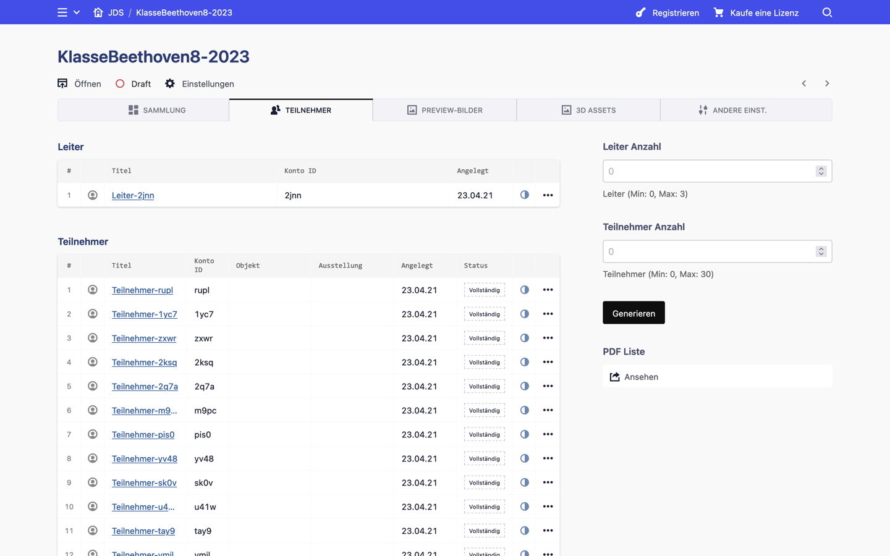
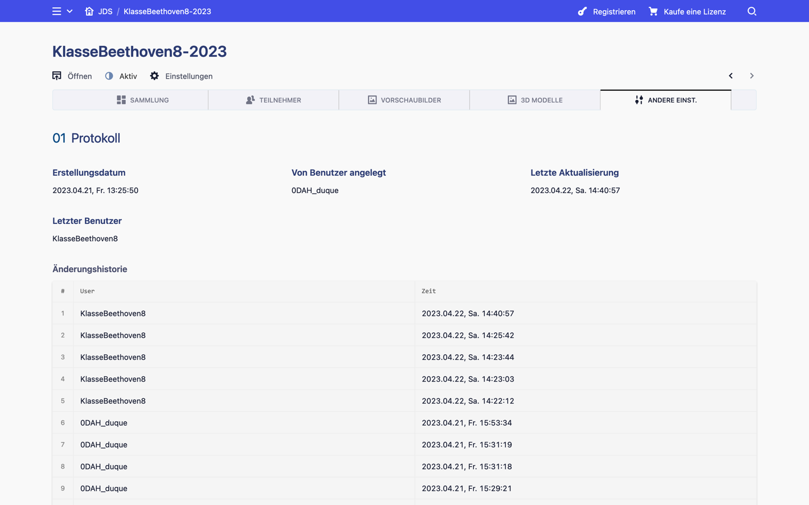
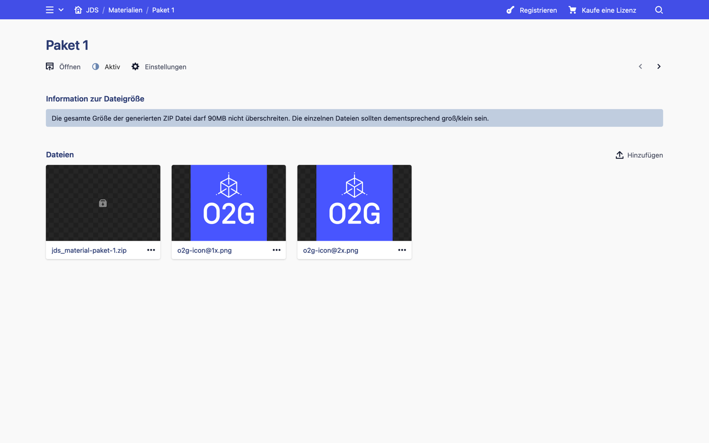
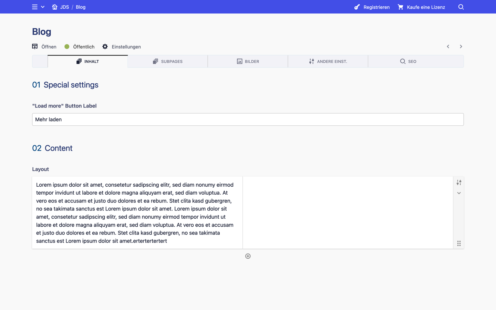

[« Benutzung](../README.md)

---

# Admin-Bereich

Es wird empfohlen, die Kirby-Dokumentation zu lesen.
https://getkirby.com/docs/guide/content/introduction

Im Admin-Bereich ist der Inhalt in Tabs gegliedert. Viele Tabs erfüllen gleiche Zwecke, z. B. können Sie im Bilder-Tab Bilder hochladen, die dann auf den jeweiligen Seiten verwendet werden können. Oder im Tab 'SEO' werden Search-Engine-Informationen eingegeben, z. B. für die Google-Indizierung oder die Vorschau beim Teilen auf Sozialen Medien.

*Hinweis: An dieser Stelle ist es wichtig zu erwähnen, dass Kirby CMS, die Basis der Plattform, die Mediendateien in den Seiten kapselt. Das bedeutet, dass wenn Sie ein Bild in einem Bereich hochladen, dieses nur in diesem Kontext (auf dieser Seite) verwendet werden kann. Wenn Sie diese Seite dann löschen, so werden die Bilder auch vom System gelöscht. Im Gegenzug, ein Beispiel einer pseudo-globalen Medienbibliothek sind die Workshops. Als Admin können Sie Bilder und 3D-Dateien physischer Objekte in einem Workshop hochladen, die Teilnehmer:innen können diese aber für ihre Unterseiten (3D-Objekt Seite) verwenden. Diese Art der Datenvererbung muss aber explizit in der Programmierung definiert werden. Für mehr Details bitte die Kirby-Dokumentation lesen.*

1. [Site](#1-site)
2. [Benutzer](#2-benutzer)
3. [Workshop](#3-workshop) 
4. [Objekt](#4-objekt)
5. [Ausstellung](#5-ausstellung)
6. [Teilnehmer](#6-teilnehmer)
7. [Leiter](#7-leiter)
8. [Andere/besondere Seiten](#8-anderebesondere-seiten)

## 1. Site

Das System wird in Kirby 'Site' genannt, also die komplette Website. Das ist auch die Startansicht, wenn Sie sich als Admin einloggen. Site besitzt 5 Tabs:

* Workshops/Seiten 
* Content Einstellungen
* Website Einstellungen
* Bilder
* Meta Information (SEO) 

### Workshops/Seiten

Hier werden die Workshops und restlichen Seiten aufgelistet. Diese Seiten können Unterseiten haben. Ausstellungen und Objekte sind bspw. Unterseiten eines Workshops.

### Content Einstellungen

Hier werden 2 Arten von Daten verwaltet, die letztendlich durch Seiten repräsentiert werden. 'Daten für Felder' enthalten Daten, die für die Dropdowns und andere Eingabeelemente wichtig sind, z. B. die Bundesländer oder Begriffe für die Klassifikation. In 'Beschriftungen und Nachrichten' können eher Beschriftungen für Bereiche oder kurze Fließtexte bearbeitet werden.

Mehr zu [Datenfelder »](#datenfelder)

Mehr zu [Beschriftungen und Nachrichten »](#beschriftungen-und-nachrichten)

Workshop-Tab (Hauptansicht) |  Content Einstellungen-Tab
:-------------------------:|:-------------------------:
  |  

### Website Einstellungen

Hier können bspw. Logos ausgewählt werden, die in der Sammlung erscheinen. Oder E-Mail-Adressen für den Empfang der generierten E-Mails. Auch die Gültigkeit der temporären Gruppenkonten sowie System-Funktionen zum bereinigen der Daten befinden sich hier.

### Bilder

Hier können Bilder hochgeladen werden, die in 'Site' benutzt werden können. Konkret in diesem Fall also die Logos, die man unter Website-Einstellungen auswählen kann. Dieser Tab hat für alle Seiten die gleiche Funktion.

Website Einstellungen-Tab |  Bilder-Tab
:-------------------------:|:-------------------------:
  |  

### Meta Information (SEO) 

Die Meta-Informationen werden für die Google-Indizierung verwendet, oder wenn der Link einer Seite geteilt oder verschickt wird. Die Meta-Informationen werden ausgelesen und das sind die Vorschauen, die man zu sehen bekommt, sei es nur Text (z. B. nach einer Google-Suche) oder Text-Bild Kombination (z. B. wenn man einen Link in Facebook oder WhatsApp teilt). Dieser Tab hat für alle Seiten, die öffentlich sind, die gleiche Funktion. Wenn eine Seite keine SEO-Informationen enthält, so werden die Informationen der 'Site' verwendet. Dementsprechend bitte zumindest hier einige Felder befüllen.

SEO-Tab |  
:-------------------------:|
  |  

---

## 2. Benutzer

Wechselt man zu der Ansicht "Konten", bekommt man eine Benutzerauflistung zu sehen (Admins und temporäre Benutzer) und man kann die Benutzer bearbeiten. 

Benutzer besitzen keine Tabs, alle Daten werden direkt angezeigt.

Navigation zu "Konten" | Admin-Konto |  Gruppenkonto
:-------------------------:|:-------------------------:|:-------------------------:
  |   |  

---

## 3. Workshop

In einem Workshop hat meine eine Übersicht der Objekten, Ausstellungen und Teilnehmern. Workshops haben folgende Tabs:

* Sammlung
* Teilnehmer 
* Vorschaubilder
* 3D-Modelle 
* Andere Einstellungen 

### Sammlung

Dieser Tab enthält Workshop-Informationen und Einstellungen, die man händisch eingeben muss (z. B. 'Institution / Kurs') oder die automatisch vom System eingestellt werden (z. B. 'Materialien' oder 'Abgegeben'). In der Regel können automatisch erstellte Daten auch händisch angepasst werden, abgesehen vom Kommentar (dies ist die kurze Nachricht, die der/die Leiter:in beim Versenden des Workshops eingibt).

Die Auflistungen der Objekte und Ausstellungen haben einen Status, um schnell einen Überblick zu bekommen, ob manche Objekte/Ausstellungen unvollständige Daten haben.

Wenn ein Workshop angelegt wird, wird er mit allen Materialien-Paketen verknüpft. Diese sind ZIP-Dateien, die die Leiter:innen im Workshop-Bereich herunterladen können (mehr dazu weiter [hier](#materialien-und-materialien-paket)).

Mit dem Button '3D Modelle verlinken' werden die Vorschaubilder, die Sie als Administrator im Admin-Bereich hochgeladen und Teilnehmer für ihr physisches Objekt im Workshop-Bereich ausgewählt haben, mit der passenden 3D-Datei verlinkt, falls sie existiert. Dies erfolgt in der Regel automatisch. Sollte ein physisches Objekt nur ein Bild anzeigen, überprüfen Sie bitte, dass 1) die 3D-Datei hochgeladen wurde (3D Modelle Tab) und 2) die Namen aus O2G nicht geändert wurden. Die Beziehung der Dateien entsteht durch die Namen.

Sammlung-Tab (leer) |  Sammlung-Tab  | Sammlung-Tab (gescrollt)
:-------------------------:|:-------------------------:|:-------------------------:
  |   |  

### Teilnehmer

Hier werden Teilnehmer und Leiter generiert. Auch die PDF-Übersicht zur Übergabe an die Leiter kann hier abgerufen werden.

Teilnehmer-Tab (leer) |  Teilnehmer-Tab
:-------------------------:|:-------------------------:
  |  

### Vorschaubilder

Hier laden Sie die Vorschaubilder der Objekte, die Sie mit O2G exportiert haben.

### 3D Modelle 

Hier laden Sie die 3D-Dateien der Objekte, die Sie mit O2G exportiert haben.

Vorschaubilder-Tab |  3D Modelle-Tab
:-------------------------:|:-------------------------:
  |  

### Andere Einstellungen

Hier finden Sie hauptsächlich die Änderungshistorie der jeweiligen Seite. Dieser Bereich ist für fast alle Seiten gleich. 

Andere Einst.-Tab |  
:-------------------------:|
  |  

---

## 4. Objekt
In einem Objekt können Sie die Daten überprüfen (oder anpassen/vervollständigen), die die Teilnehmer eingegeben haben. Sie ist folgendermaßen gegliedert:

* Inhalt
* Bilder
* Mediendateien
* Andere Einstellungen
* SEO

Den Namen eines Objekts können Sie bearbeiten, indem Sie auf den Namen oben links klicken. Eine Anpassung des URL-Anhangs ist nicht notwendig, das System erledigt das beim Speichern automatisch.

### Inhalt

Enthält alle objektrelevanten Daten, wie verlinkte Mediendateien, Klassifikation, Einführungstexte, etc. Wenn Inhalte nicht vollständig für eine Freigabe sind, wird dies in einem roten Kästchen protokolliert. Dies funktioniert für andere Seitentypen gleich (z. B. Ausstellungen).

Manche Felder werden in Abhängigkeit des Objekttyps versteckt oder angezeigt.

*Hinweis zu Bilder/Medien: Hier werden die **selektierten** Dateien angezeigt bzw. man kann sie hier selektieren (Medienfelder). In den Tabs 'Bilder' und 'Mediendateien' werden lediglich die auf dieser Seite hochgeladenen Bilder und Medien aufgelistet. Dies gilt auch für alle anderen Seitentypen.*

Inhalt-Tab (leer) |  Inhalt-Tab  | Inhalt-Tab (gescrollt)
:-------------------------:|:-------------------------:|:-------------------------:
  |   |  

### Bilder

Relevant für Teilnehmerin:innen, die den Objekttyp born-digital oder physisch ausgewählt haben. Hier erscheint das Vorschaubild für das Museum (physisches Objekt) oder entweder a) das Vorschaubild des Videos (s. Mediendateien) oder ein hochauflösendes Bild, das vergrößert werden kann (beides im Fall born-digital). Hier sieht die Logik für die Präsentation im Sammlung-Bereich wie folgt aus: Wenn Vorschaubild und Video vorhanden sind, geht das System davon aus, dass das Bild die Vorschau des Videos ist. Wenn nur das Vorschaubild vorhanden ist, handelt es sich um ein hochauflösendes Bild zum vergrößern.

### Mediendateien

Relevant für Teilnehmerin:innen, die den Objekttyp digital-born ausgewählt haben. Hier werden Sie die Video-Datei finden.

Bilder-Tab |  Medien-Tab
:-------------------------:|:-------------------------:
  |  

### Andere Einstellungen

Hier finden Sie die Änderungshistorie und in diesem Fall auch einen Schalter für die Sitemap-Funktion. Objekte und Ausstellungen sind standardmäßig für die Sitemap freigegeben, damit Suchmaschinen diese Seiten finden und indizieren können.

### SEO

S. bitte Erläuterung in 'Site'.

Andere Einst.-Tab |  SEO-Tab
:-------------------------:|:-------------------------:
  |  

## 5. Ausstellung

Ähnlich wie bei den Objekten finden Sie hier die Daten zu der jeweiligen Ausstellung. Ausstellungen sind wie folgt gegliedert:

* Inhalt
* Andere Einstellungen
* SEO

Den Namen einer Ausstellung können Sie bearbeiten, indem Sie auf den Namen oben links klicken. Eine Anpassung des URL-Anhangs ist nicht notwendig, das System erledigt das beim Speichern automatisch.

### Inhalt

Hier finden Sie neben Thema und Einführungstext der Ausstellung auch die verlinkten Personen, die zu dieser Ausstellung gehören. Neben jeder Person befinden sich ein Feld für einen Einführungstext des Objekts im Kontext der Ausstellung.

Auch hier werden Hinweise/Warnungen angezeigt, wenn Inhalte fehlen oder Themen nicht passen (Ausstellung und Objekt sollten das gleiche Thema haben).

*Wichtig: Personen dürfen nur zu einer einzigen Ausstellung gehören!*

### Andere Einstellungen

Hier finden Sie die Änderungshistorie und in diesem Fall auch einen Schalter für die Sitemap-Funktion. Objekte und Ausstellungen sind standardmäßig für die Sitemap freigegeben, damit Suchmaschinen diese Seiten finden und indizieren können.

### SEO

S. bitte Erläuterung in 'Site'.

Inhalt-Tab |  Andere Einst.-Tab  | SEO-Tab
:-------------------------:|:-------------------------:|:-------------------------:
  |   |  

## 6. Teilnehmer

Eine Teilnehmer-Seite besteht aus 3 Tabs:

* Inhalt
* Einstellungen
* Andere Einstellungen

Den Namen eines/einer Teilnehmers:in können Sie bearbeiten, indem Sie auf den Namen oben links klicken. Eine Anpassung des URL-Anhangs ist zwar erlaubt, Sie sollten dies aber nur unter bestimmten Bedingungen tun, da dieser die ID des Benutzers repräsentiert!

### Inhalt

Alle relevanten Daten zur Person. Die Datenschutzerklärung kann hier nicht angepasst werden! Dies kann nur im Workshop-Bereich des/der Teilnehmers:in gesetzt werden.

### Einstellungen

Hier können Sie, so wie Leiter im Workshop-Bereich, die PIN eines/einer Teilnehmers:in zurücksetzen, falls vorhanden.

### Andere Einstellungen

Hier finden Sie hauptsächlich die Änderungshistorie der jeweiligen Seite. Dieser Bereich ist für fast alle Seiten gleich. 

Inhalt-Tab |  Einstellungen-Tab  | Andere Einst.-Tab 
:-------------------------:|:-------------------------:|:-------------------------:
  |   |  

## 7. Leiter

Eine Leiter-Seite ist ziemlich überschaubar, sie besitzt nur 2 Tabs:

* Einstellungen
* Andere Einstellungen

Den Namen eines/einer Leiters:in können Sie bearbeiten, indem Sie auf den Namen oben links klicken. Eine Anpassung des URL-Anhangs ist zwar erlaubt, Sie sollten dies aber nur unter bestimmten Bedingungen tun, da dieser die ID des Benutzers repräsentiert!

### Einstellungen

Hier können Sie die PIN eines/einer Leiters:in zurücksetzen, falls vorhanden.

### Andere Einstellungen

Hier finden Sie hauptsächlich die Änderungshistorie der jeweiligen Seite. Dieser Bereich ist für fast alle Seiten gleich. 

Einstellungen-Tab  | Andere Einst.-Tab 
:-------------------------:|:-------------------------:
 |  

## 8. Andere/besondere Seiten

### Datenfelder

Hier werden die Daten für die Dropdown-Felder eingetragen, z. B. Bundesländer, Klassifikationen, usw. Wichtig dabei ist, dass der Wert immer einzigartig ist. Der Wert (quasi eine ID) wird mit dem Namen synchronisiert, während Sie etwas eingeben, kann aber trotzdem händisch angepasst werden, falls nötig. Einen Sonderfall finden wir in den Daten für die Klassifikationen: diese können verschachtelt werden. Das heißt, ein "Hauptfeld" hat einen Namen und einen Wert, Sie können aber auch Unterkategorien anlegen, die auch einen Namen und einen Wert haben werden.

Im Tab 'JSON Dateien' können Sie einen JSON-Datensatz für die Länderliste hochladen und diese Datei dann im Tab 'Daten' selektieren. Die aktuellen Daten entstammen aus folgender Datenbank:

https://stefangabos.github.io/world_countries

Im Tab 'Daten' können Sie auch auswählen, ob Sie eine lokale JSON-Datei (also eine 'hochgeladene') oder eine Online-Datenbank verwenden wollen. Beide Werte sind im System konfiguriert und es wird empfohlen, die lokale zu werden, damit die Website nicht externe URLs aufrufen muss.

Für beide Fälle müssen Sie identifizieren, wie die Parameter für 'Beschriftung' und 'Wert' in Ihren JSON-Daten heißen. Bspw. steht in der von uns verwendeten JSON-Datei der Parameter mit dem Namen 'name' für die Beschriftung und der Parameter mit dem Namen 'alpha2' für den 2-stelligen Ländercode (z. B. de, en, it), den wir als Wert deklarieren wollen.

Bitte denken Sie daran, dass wenn Sie Werte verändern ältere Objekte und Ausstellungen, die diese Werte verwendet haben, nicht mehr zuverlässig eine Zuordnung finden werden können.

Daten |  Daten eingeben  |  JSON-Dateien
:-------------------------:|:-------------------------:|:-------------------------:
  |   | 

### Beschriftungen und Nachrichten

In diesem Seitentyp können Sie Beschriftungen und Nachrichten definieren, die im Workshop- oder Sammlung-Bereich angezeigt werden. Diese Felder sollten selbsterklärend sein. Ein paar Hinweise dazu finden Sie direkt in einer Beschriftungen-Seite.

Beschriftungen |  Beschriftungen (gescrollt)
:-------------------------:|:-------------------------:
  |  

### Materialien und Material-Paket

Die Materialien-Seite kann einen Einführungstext haben, der im Workshop-Bereich der Leiter:innen (Tab "Materialien") angezeigt wird, gefolgt von einer Liste von Material-Pakete, die Sie herunterladen können.

Die Material-Pakete sind Unterseiten der Materialien-Seite. Hier können Sie Dateien, die relevant für dieses Paket sind, hochladen. Das System erstellt automatisch nach jedem Hochladen oder Löschen einer Datei eine ZIP-Datei neu. Diese ZIP-Datei erscheint im Workshop-Bereich und kann dann von den Leitern:innen heruntergeladen werden. Die ZIP-Datei im jeweiligen Paket bitte nicht entfernen!

Materialien |  Material-Paket (Subseite)
:-------------------------:|:-------------------------:
  |  

### Blog

Der Inhalt der Blog-Seite und dessen Unterseiten basiert auf Kirby-Layouts. Ein Layout wird durch Spalten repräsentiert, z. B. 1 Spalte, 2 gleichmäßige Spalten, 2 ungleichmäßige Spalten, 4 gleichmäßige Spalten, etc. In jeder Spalte können Sie 'Blöcke' einfügen. Ein Block kann eine Überschrift oder eine Liste oder Fließtext sein, aber auch Bilder und einige besondere Elemente sind erlaubt. Mehr dazu in der Kirby Dokumentation:

https://getkirby.com/docs/reference/panel/fields/layout

Blog  |  Blog Subseiten  |  Blog im Frontend
:-------------------------:|:-------------------------:|:-------------------------:
 |   |  

### Normale Seiten

Normale Seiten, dazu zählen auch rechtliche oder die Error-Seite, basieren ähnlich wie die Blog-Seiten auf Layouts. Mehr dazu in der Kirby-Dokumentation:

https://getkirby.com/docs/reference/panel/fields/layout

Inhalt normaler Seiten |  Subseiten normaler Seiten
:-------------------------:|:-------------------------:
  |  

---

[« Benutzung](../README.md)