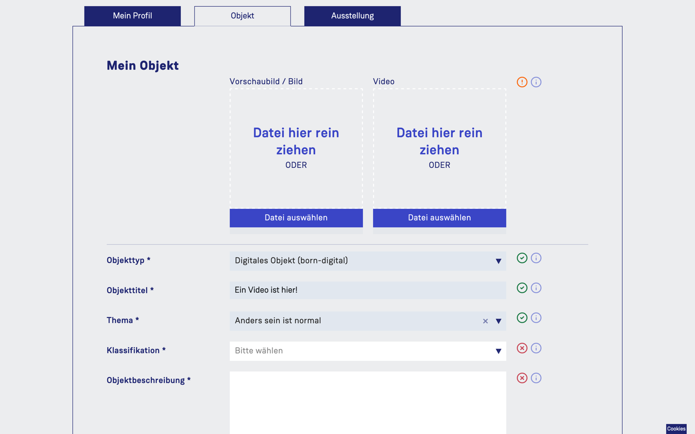
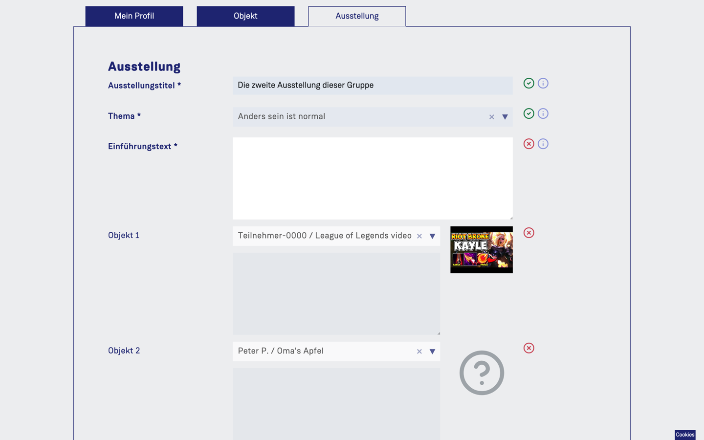
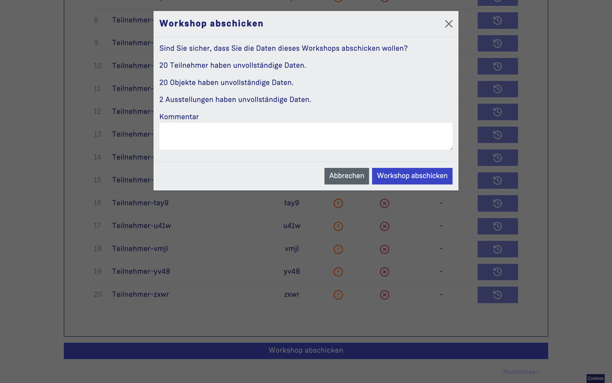
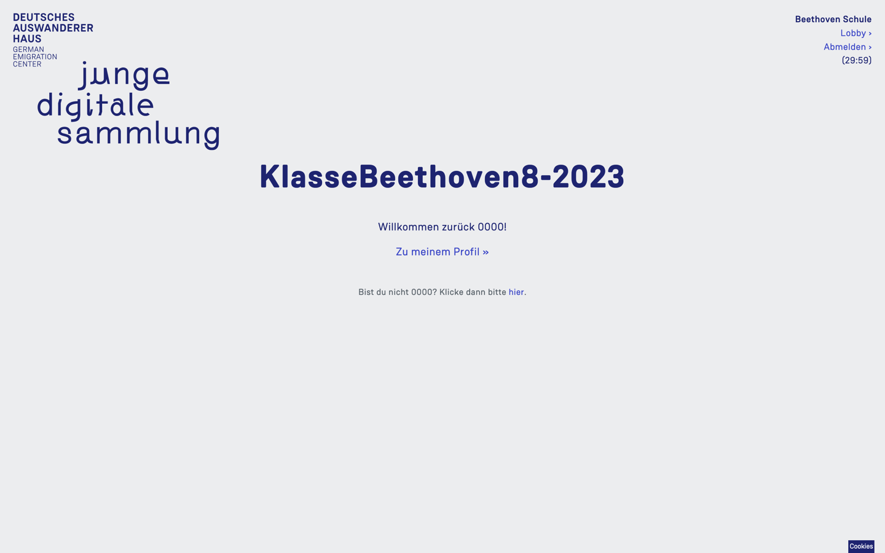

[« Benutzung](../README.md)

---

# Workshop-Bereich

Im Workshop-Raum können Teilnehmer:innen Dateneinheiten anlegen, die sich in personenbezogene, objektbezogene und ausstellungsbezogene Daten gliedern. Die Teilnehmer:innen müssen zunächst einer Nutzungsvereinbarung mit DSE zustimmen. Außerdem können sie in kleineren Gruppen eine weitere Dateneinheit für jeweils eine virtuelle Ausstellung bearbeiten. Das System ist so konzipiert, dass nur Leiter Ausstellungen Anlegen dürfen, um die Zusammenarbeit kontrollierter zu gestalten.

Das Eingeben der Daten erfolgt über Eingabemasken mit Freitextfeldern und Dropdowns. Es gibt Pflichtfelder und optionale Eingabemöglichkeiten – Pflichtfelder sind als solche gekennzeichnet.

Bei der Objektauswahl sind sowohl 3D-Objekte als auch Born Digital und Embedded Objects zulässig, insofern dies aus rechtlichen Gründen möglich ist. Von den 3D-Objekten können von den Teilnehmenden zunächst einfache (Handy-)Fotos als Vorschaubilder hochgeladen werden. Diese Bilder sind nur im Workshop-Bereich aufrufbar und dienen nur zu internen Zwecken. Dies ermöglicht auch die leichtere Arbeit mit den Objekten, auch wenn diese gerade nicht greifbar sind, und unterstützt die Planung des im Museum stattfindenden Workshops. Denn hier werden die Objekte hochauflösend fotografiert und nach Möglichkeit 3D-gescannt. Zusätzlich zum Foto kann es einen 3D-Scan geben. Insgesamt sind folgende Objekttypen und -formate zugelassen: Bilder (jpg, png, heic), 3D-Modelle (glb, gltf), Video (mp4), Embedded Links aus unterschiedlichen Plattformen (YouTube, Vimeo, TikTok, Instagram, Twitter, SoundCloud und Spotify).

Nach Fertigstellung des Workshops erfolgt eine Abgabe an das Museum, diese setzt das Ausfüllen der Pflichtfelder voraus. Hinweise auf fehlende Eingaben erleichtern das Ausfüllen. Dies beinhaltet auch die Bestätigung, dass eine Nutzungsvereinbarung mit Datenschutzerklärung unterzeichnet wurde. Diese Bestätigungen sind Voraussetzung dafür, dass die Beiträge der Teilnehmer:innen für die Redaktion des DAHs als vollständig markiert werden.

Eine weitere Dateneinheit beinhaltet die Ausstellung. Es wird der jeweilige Impuls ausgewählt und die Objekttitel der Gruppenmitglieder (Dropdown Menüs). Neu eingetragen werden im Datensatz für die Ausstellung ein Ausstellungstitel, ein Einführungstext und zu jedem der Objekte eine Bildunterschrift. Die Gruppe bzw. eins ihrer Mitglieder bestätigt die Abgabe des Datensatzes für die Redaktion des DAH.

## Personenbezogene Daten
* Vorname und erster Buchstabe vom Nachnamen
* Benutzername
* Geschlecht
* Alter
* Geburtsland
* Geburtsland (Historische Länder)
* Lebensstationen
* Lebensstationen (Historische Länder)
* "Folgende Zugehörigkeiten sind mir wichtig"
* Bundesland
* Klassenstufe
* Datenschutzerklärung

Profil-Tab |  
:-------------------------:|
  |  

## Objektbezogene Daten
* Objekttyp
* Objekttitel
* Thema
* Klassifikation
* Objektbeschreibung
* Entstehungszeit
* Historischer, kultureller Hintergrund
* Objektstory (thematischer und persönlicher Bezug)

(für 3D-Objekte)
* Vorschaubild für Museum
* Vorschaubild/3D Model des Objekts
* Material
* Maße (in cm) 
* Gewicht (in g)
* Aufnahmedatum Digitalisat 
* Digitalisierungsmethode
* Digitalisierungsgerät 
* Software, Version 
* Bearbeitung des Digitalisates

(für Embedded Objekte)
* URL / Link 

(für Born Digital Objekte)
* Vorschaubild Video/High-Resolution-Foto
* Video

Die Teilnehmer können jederzeit zwischen Objekttypen wechseln, sie müssen allerdings eine Abfrage bestätigen, denn manche Daten werden dadurch gelöscht, um unnötige Daten auf dem Server zu löschen.

Objekt-Tab (gescrollt) |  Objekttyp wechseln
:-------------------------:|:-------------------------:
  |  

## Ausstellungs-Daten
* Ausstellungstitel
* Thema (nur Ansicht)
* Einführungstext
* Objekte (bis 5, nur Ansicht)
* Bildunterschriften (bis 5, nur eigener Text darf bearbeitet werden)

Ausstellung-Tab (gescrollt) |  
:-------------------------:|
  | 

## Teilnehmer-Übersicht (Leiter)

* Keine Eingabefelder, aber PINs der Teilnehmer können zurückgesetzt werden.

Teilnehmer-Übersicht (Leiter) |  PIN Reset (Leiter)
:-------------------------:|:-------------------------:
  |    | 

## Ausstellungen-Übersicht (Leiter)

* Ausstellung anlegen
* Eine vorhandene Ausstellung bearbeiten

Jeweils in jeder Ausstellung

* Ausstellungstitel
* Thema
* Einführungstext
* Objekte (bis 5)
* Bildunterschriften (bis 5)

Ausstellungen-Übersicht (Leiter) |  Eine Ausstellung (Leiter)
:-------------------------:|:-------------------------:
  |    | 

## Profil und Materialien (Leiter)

* Vorname und erster Buchstabe vom Nachnamen (Profil-Tab)
* Materialien können heruntergeladen werden (Materialien-Tab)

Profil-Tab (Leiter) |  Materialien-Tab (Leiter)
:-------------------------:|:-------------------------:
  |    | 

## Workshop abschicken (Leiter)

Leiter:innen haben die Möglichkeit, den Workshop als fertig zu markieren, indem sie eine E-Mail vom System generieren lassen. Der Button "Workshop abschicken" befindet sich bei allen Leiter-Tabs im unteren Bereich. Vor dem Abschicken erscheint eine Abfrage, in der die Leiter:innen auch einen Kommentar für das Museum eingeben können. Auch auf fehlende Datensätze wird hier hingewiesen.

Workshop abschicken Button (Leiter)  |  Workshop abschicken Button (Leiter)  |  Workshop abschicken Modal (Leiter)
:-------------------------:|:-------------------------:|:-------------------------:
  |    |  

## Teilnehmer-Wechsel und Abmelden

Ein Wechsel der Teilnehmer ist möglich. Dies erleichtert die Arbeit, falls mehrere Personen an einem Rechner arbeiten. Der Button "Lobby" oben rechts bringt die Teilnehmer zur Lobby. Hier können sie zurück zu ihrer persönlichen Seite oder sich als Teilnehmer ausloggen. Nun kann der nächste Teilnehmer dran arbeiten. Um sich komplett abzumelden (also das Gruppenkonto), müssen die Teilnehmer auf "Abmelden" klicken. Das System hat einen Countdown integriert. Nach Ablauf der Zeit wird das Gruppenkonto ausgeloggt.

Gruppenkonto abmelden (oben rechts) |  Teilnehmer in der Lobby wechseln
:-------------------------:|:-------------------------:
  |    | 

---

[« Benutzung](../README.md)